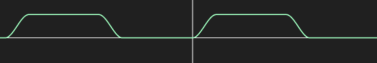
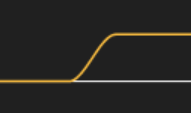
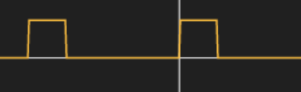

# CIS 566 Project 3: Case Study

* Name: Linshen Xiao
* PennKey: Linshen
* Tested on: Windows 10, Intel(R) Core(TM) i7-6700HQ CPU @ 2.60GHz, 16.0GB, NVIDIA GeForce GTX 970M (Personal computer)

## Assignment Description

For this assignment, you will re-create various animations demonstrating a combination of toolbox functions and the rendering techniques you've already learned. The motivation for this is to help you become more familiar with toolbox functions as well as give you experience in producing a desired aesthetic.

## Assignment Details

* I make three intermediate animations

### Paw Metaballs

#### Online Implementation
* [https://www.shadertoy.com/view/XstcR8](https://www.shadertoy.com/view/XstcR8)

#### Reference Animation

#### Techniques Used
* Metaballs are used to render this scene. First, 8 balls are repeated around the origin with a fixed angle(2.0/8.0*PI), then the balls will move back and to the origin with a certain lag. A simple sin function is used to move the balls along the line connecting the origin and their original positions.

#### Motion Functions

##### Metaballs Movements
* Sin and Cos function.

#### Extra Credit
* Adjust the BALLNUM to change the number metaballs.
* Adjust the BALLRADIUS and BALLRADIUS2 to change the size of the metaballs.
* Adjust the RADIUS to change the radius of the circle metaballs lie along.

### Tri-Colored Cube

#### Online Implementation
* [https://www.shadertoy.com/view/ldcyzN](https://www.shadertoy.com/view/ldcyzN)

#### Reference Animation

#### Techniques Used
* The cube is rendered with raymarching. Orthographic projection is used instead of perspective one. Color is decided by the normal of the cube. There are two types of rotation. The First type is to rotate the cube along x-axis, this is done by rotating the ray origin and ray direction. The second one is to rotate the "color". This is done by rotate the uv with a larger scale cube and masked by another normal scale cube raymarching. After the first raymarching, the color will multiply with a static normal scale cube raymarching(if hit the cube, return white, else return black) to create an illusion of "rotating color".

#### Motion Functions

##### UV Rotation
* f1(x) = min(frac(x /4.0) * 4.0, 1.0);
* f2(x) = -sign((frac(x/8.0)*2.0 - 1.0));
* f3(x) = smoothstep(0.0, 1.0, f1(x) * f2(x)  -(f2(x) * 0.5 - 0.5));

##### Cube Rotation
* f4(x) = smoothstep(0.0, 1.0, clamp(x -2.0, 0.0, 1.0));
* f5(x) = smoothstep(0.0, 1.0, clamp(x -6.0, 0.0, 1.0));

##### Mask Appearance
* f6(x) = sign(frac((x - 1.0) / 4.0) * 4.0 - 3.0) * 0.5 + 0.5;

### Spindle of Death

#### Online Implementation
* [https://www.shadertoy.com/view/MdcyzN](https://www.shadertoy.com/view/MdcyzN)

#### Reference Animation

#### Techniques Used
* The scene is rendered with raymarching. Orthographic projection is used instead of perspective one. Torus SDF from IQ is used to render the wireframe and the sphere SDF is used to render white dots. Different SDF functions has different color index to decide its color. pModPolar function from [hg_sdf](http://mercury.sexy/hg_sdf/) is used to repeat the torus around the origin by a fixed angle, The dots will rotate along with the frame with a certain lag.

#### Motion Functions

##### Dots Rotation
* Sin and Cos function.

##### Camera Rotation
* Same as the UV Rotation I mentioned above.

#### Extra Credit
* Adjust the NUM to change the number of wireframes and white dots.
* Adjust the LAG to change the lag of the white dots' rotations.

## Resources
- [Raymarching - Primitives](https://www.shadertoy.com/view/Xds3zN)
- [Cell Merge with Metaballs](https://www.shadertoy.com/view/MllXDH)
- [Cube of Cubes](https://www.shadertoy.com/view/Xll3DM)
- [Placing a Camera: the LookAt Function](https://www.scratchapixel.com/lessons/mathematics-physics-for-computer-graphics/lookat-function)
- [hg_sdf](http://mercury.sexy/hg_sdf/)
- [Modeling with distance functions](http://www.iquilezles.org/www/articles/distfunctions/distfunctions.htm)
